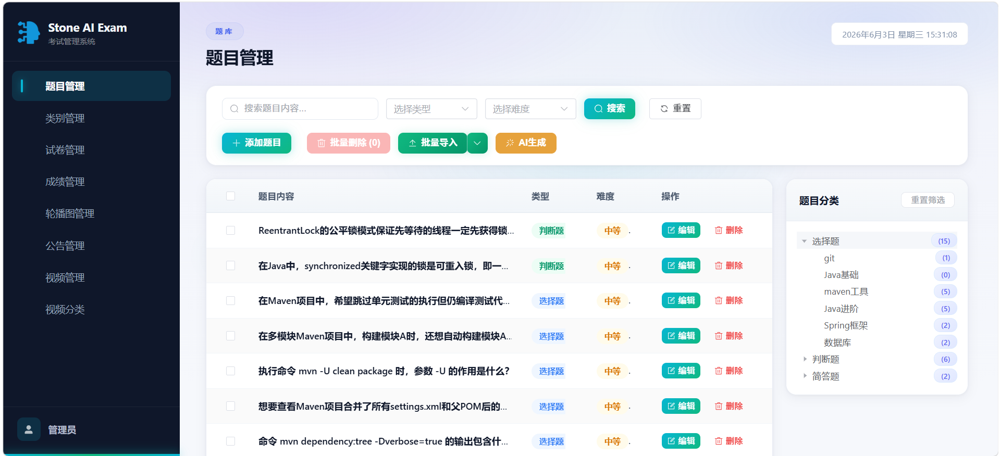

# Stone AI Exam

### 智能学习考试平台

[](https://vuejs.org)
[](https://vitejs.dev)
[](https://element-plus.org)
[](LICENSE)

**AI 出题 · 智能批阅 · 在线考试 · 面试模拟 · 视频学习**

</div>

---

<p align="center">
  
</p>

---

## 🚀 核心能力

<table>
<tr>
<td width="50%">

### 🧑‍🎓 学习考试

- **在线考试** — 限时答题，自动提交，实时计分
- **智能刷题** — 按分类/难度逐题练习，即时解析
- **AI 批阅** — 主观题自动评分，智能分析报告
- **排行榜** — 实时排名竞技，激发学习动力
- **3 分钟视频** — 技术短视频分类浏览学习

</td>
<td width="50%">

### 🎯 面试突击

- **企业真题** — 各大公司面试真题浏览练习
- **模拟面试** — AI 模拟面试官，智能追问评估
- **个性化建议** — 面试后生成学习建议与资源推荐
- **邀请码系统** — 面试邀请码激活与管理

</td>
</tr>
</table>

---

## 🛠️ 管理后台

| 模块          | 亮点                                         |
|:-----------:| ------------------------------------------ |
| 📋 **题目管理** | 增删改查 · Excel 批量导入 · **🤖 AI 智能生成** · 分类树筛选 |
| 📂 **类别管理** | 两级树形分类 · 灵活扩展                              |
| 📄 **试卷管理** | 手动组卷 · **🤖 AI 智能出卷** · 发布/停止 · 批量操作       |
| 📈 **成绩管理** | 多维度筛选 · 详情查看 · **🤖 AI 自动批阅**              |
| 🎠 **轮播图**  | 图片上传 · 启用/禁用 · 排序                          |
| 📢 **公告**   | 系统公告/新功能/通知 · 优先级分级                        |
| 🎬 **视频**   | 上传审核 · 上架/下架 · 拒绝原因反馈                      |
| 🏢 **企业**   | 企业信息管理 · 分类维护                              |
| ✅ **审核**    | 用户贡献题目审核                                   |

---

## ⚡ 快速开始

```bash
git clone <repo-url> && cd stone-aiexam-web
npm install
npm run dev        # 开发 → http://localhost:3001
npm run build      # 构建 → dist/
```

> 后端 API 代理至 `http://localhost:8080`，配置见 [`vite.config.js`](vite.config.js)

---

## 🧱 技术架构

```
Vue 3 (Composition API)    前端框架
Element Plus                UI 组件库
Vue Router 4                路由管理
Pinia                       状态管理
Axios                       HTTP 请求
ECharts                     数据图表
html2canvas                 截图导出
Vite 4                      构建工具
```

---

## 📁 项目结构

```
src/
├── api/          API 请求模块（exam / question / paper / video …）
├── components/   通用组件
├── router/       路由配置（40+ 路由，懒加载）
├── styles/       公共样式（admin-common.css 统一管理后台风格）
├── utils/        工具函数（Axios 封装）
├── views/        页面组件（20+ 页面）
└── App.vue       根组件
```

---

<div align="center">

**Stone AI Exam** · Made with ❤️

</div>
