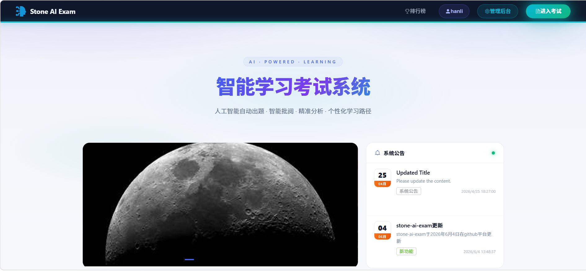
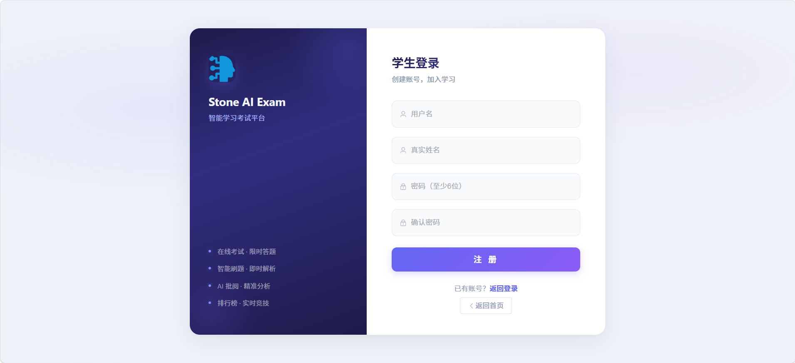
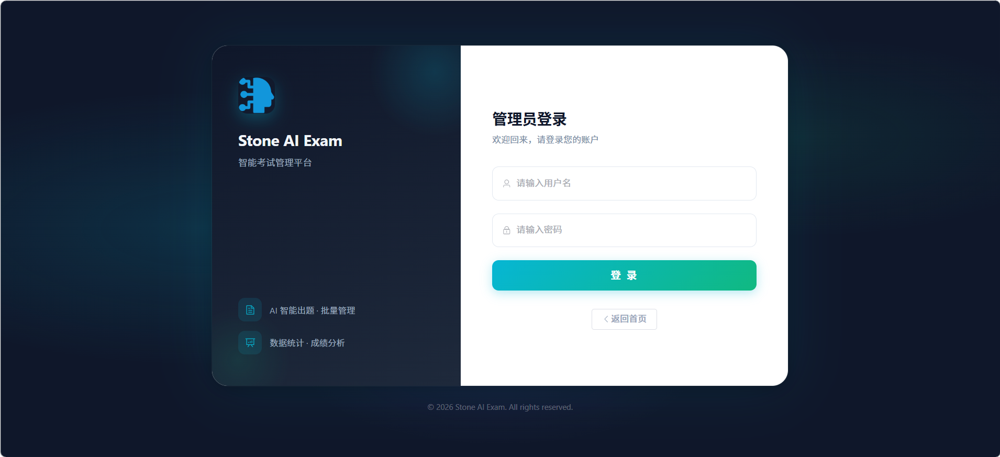
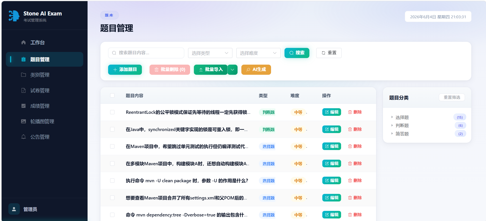

# Stone AI Exam

### 智能学习考试平台

[](https://vuejs.org)
[](https://vitejs.dev)
[](https://element-plus.org)
[](LICENSE)

**AI 出题 · 智能批阅 · 在线考试 · 学习排行**

<p align="center">
  <a href="https://github.com/LinShinan/stone-aiexam-web">
    
  </a>
  &nbsp;&nbsp;
  <a href="https://github.com/LinShinan/stone-ai-exam">
    
  </a>
</p>

> 本项目为 **前端部分**，后端代码请访问 [stone-ai-exam](https://github.com/LinShinan/stone-ai-exam)

---

## 📸 预览

### 🏠 首页

<p align="center">
  
</p>

### 🎓 学生登录 / 注册

<p align="center">
  
</p>

### 👤 管理员登录

<p align="center">
  
</p>

### 🛠️ 管理后台

<p align="center">
  
</p>

---

## 🏗️ 架构

```
localhost:3001 (Vue 3) ── Vite Proxy ── localhost:8080 (Spring Boot)
                              │
              ┌───────────────┼───────────────┐
              ▼               ▼               ▼
         /api/common/    /api/student/    /api/admin/
         公共接口         学生接口          管理接口
        (无需登录)       (学生登录)        (管理员 token)
```

### API 分层

| 端 | 前缀 | 鉴权 | 说明 |
|:---:|------|:---:|------|
| 🔓 common | `/api/common/**` | 无 | 轮播图、公告、排行榜、分类、题目列表 |
| 🎓 student | `/api/student/**` | 学生 token | 考试、提交、成绩、个人中心 |
| 🔐 admin | `/api/admin/**` | 管理员 token | 所有 CRUD 管理操作 |

### 鉴权流程

```
访问 /admin/* → 路由守卫检查 token → 无则跳 /admin/login
       ↓
POST /api/auth/login → 返回 token → localStorage
       ↓
后续所有 /api/admin/* 请求自动带 token 头
       ↓
401 → 清除 token → 跳回登录页
```

---

## 🚀 功能

### 学生端

| 模块 | 说明 |
|:---:|------|
| 🏠 首页 | 轮播图、公告、热门题目、快捷入口 |
| 📝 在线考试 | 选择试卷 → 限时答题 → AI 批改 → 成绩报告 |
| ✏️ 智能刷题 | 按分类/难度逐题练习，即时查看解析 |
| 📊 考试结果 | 答题详情、得分、AI 批阅报告、排名 |
| 🏆 排行榜 | 考试成绩实时排名 |
| 👤 个人主页 | 个人信息、修改密码、考试记录 |

### 管理后台

| 模块 | 功能 |
|:---:|------|
| 📋 题目管理 | 增删改查 · Excel 批量导入 · AI 智能生成 · 分类树筛选 |
| 📂 类别管理 | 两级树形分类，支持增删改查 |
| 📄 试卷管理 | 手动组卷 · AI 智能出卷 · 发布/停止 |
| 📈 成绩管理 | 多维度筛选 · AI 自动批阅 · 成绩导出 |
| 🎠 轮播图 | 上传/编辑/启用/禁用 |
| 📢 公告 | 系统公告/新功能/通知 · 优先级分级 |

### 管理后台 UI 特性

- 🎨 深色侧边栏 + 青绿发光条，与首页 Navbar 风格统一
- 📊 工作台仪表盘，真实 API 统计卡片 + 数字滚动动画
- 🏷 侧边栏子菜单图标，层次清晰
- 🔍 统一卡片式布局，`admin-common.css` 共享样式

---

## ⚡ 快速开始

```bash
git clone <repo-url> && cd stone-aiexam-web
npm install
npm run dev        # http://localhost:3001
npm run build      # 构建 → dist/
```

---

## 🧱 技术栈

| 类别 | 技术 |
|------|------|
| 框架 | Vue 3 (Composition API) |
| 构建 | Vite 4 |
| UI | Element Plus 2.3 |
| 路由 | Vue Router 4（懒加载 + 导航守卫） |
| HTTP | Axios（拦截器：自动 token + 401 处理） |
| 图表 | ECharts 5 |
| 样式 | `admin-common.css` 管理后台统一样式 |

---

## 📁 目录结构

```
src/
├── api/                    API 模块 (exam / question / paper / banner / notice)
├── components/             通用组件
├── router/                 路由配置 + 鉴权守卫
├── styles/
│   └── admin-common.css    管理后台共享样式
├── utils/
│   └── request.js          Axios 封装 + token 拦截器
├── views/
│   ├── Home.vue             首页
│   ├── StudentLogin.vue     学生登录
│   ├── StudentProfile.vue   学生个人主页
│   ├── AdminLogin.vue       管理员登录
│   ├── AdminLayout.vue      管理后台布局
│   ├── Welcome.vue          工作台仪表盘
│   ├── QuestionManage.vue   题目管理
│   ├── CategoryManage.vue   类别管理
│   ├── PaperManage.vue      试卷管理
│   ├── PaperCreate.vue      创建试卷
│   ├── ScoreManage.vue      成绩管理
│   ├── BannerManage.vue     轮播图管理
│   ├── NoticeManage.vue     公告管理
│   ├── Exam.vue             在线考试
│   ├── ExamStart.vue        开始考试
│   ├── ExamResult.vue       考试结果
│   ├── ExamRanking.vue      排行榜
│   ├── Practice.vue         刷题练习
│   └── PaperListForExam.vue 考试列表
└── main.js                 入口
```

---

<div align="center">

**Stone AI Exam** · Made with ❤️

</div>
